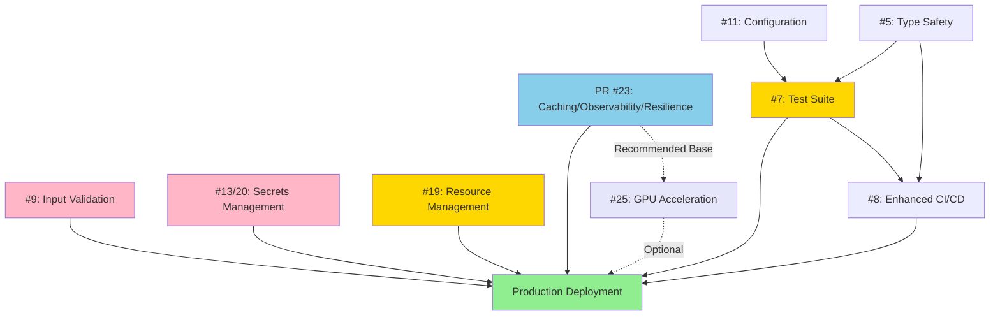

# ELEANOR V8 Production Readiness Roadmap

**Last Updated**: January 2, 2026  
**Target Production Date**: Mid-February 2026 (6-8 weeks)

## Executive Summary

This roadmap outlines the path to production-ready deployment of ELEANOR V8. The work is organized into phases with clear acceptance criteria, estimated timelines, and parallel development opportunities.

**Current Status**: Core engine complete, entering production hardening phase

## Completed Work ✅

- ✅ Core constitutional engine architecture
- ✅ Multi-critic evaluation system (Rights, Risk, Fairness, Truth, Autonomy, Pragmatics)
- ✅ Precedent alignment engine
- ✅ Uncertainty quantification system
- ✅ Governance and review triggers
- ✅ Evidence recording and audit trails
- ✅ Streaming and non-streaming APIs
- ✅ PR #23: Multi-level caching, structured logging, circuit breakers (in review)

## Production Readiness Phases

### Phase 1: Security Hardening 🔴 CRITICAL
**Timeline**: Weeks 1-3 | **Priority**: Highest | **Blocking**: Yes

#### Issue #9: Input Validation and Sanitization
**Owner**: TBD | **Status**: 🔴 Not Started

**Security Risks Addressed**:
- Prompt injection attacks
- Resource exhaustion (DoS)
- Malicious context payloads
- Code injection through serialized objects

**Deliverables**:
- [ ] `engine/validation.py` - Input validation with Pydantic
- [ ] Size limits (text: 100KB, context: 1MB)
- [ ] Prompt injection pattern detection
- [ ] Context dictionary depth/structure validation
- [ ] JSON serializability enforcement
- [ ] Security test suite with adversarial inputs
- [ ] API documentation updates

**Acceptance Criteria**:
- All inputs validated before processing
- Malicious patterns detected and rejected with clear errors
- Resource limits enforced (no OOM attacks)
- Performance impact < 10ms per request
- Security testing suite passes

**Estimated Effort**: 1-2 weeks

---

#### Issues #13 & #20: Secrets Management and Security Hardening
**Owner**: TBD | **Status**: 🔴 Not Started

**Security Risks Addressed**:
- API key exposure in logs/evidence
- No secrets rotation
- Credentials in environment variables
- Audit trail contamination

**Deliverables**:
- [ ] `engine/security/secrets.py` - Secrets provider framework
- [ ] AWS Secrets Manager integration
- [ ] HashiCorp Vault integration
- [ ] Environment variable fallback (dev only)
- [ ] `engine/security/sanitizer.py` - Credential sanitization
- [ ] Evidence recorder sanitization integration
- [ ] Log sanitization for all loggers
- [ ] Secrets rotation procedures
- [ ] Security audit documentation

**Acceptance Criteria**:
- No credentials in logs or evidence recordings
- All API keys retrieved via secrets provider
- Automatic sanitization of sensitive data
- Secrets rotation documented and tested
- Security audit passes with zero credential leaks

**Estimated Effort**: 1-2 weeks

**Configuration Example**:
```yaml
security:
  secret_provider: aws  # aws, vault, or env (dev only)
  aws:
    region: us-west-2
    secret_prefix: eleanor/prod/
```

---

### Phase 2: Reliability & Configuration 🟡 HIGH PRIORITY
**Timeline**: Weeks 3-5 | **Priority**: High | **Blocking**: Partial

#### Issue #19: Async Resource Management and Cleanup
**Owner**: TBD | **Status**: 🔴 Not Started

**Reliability Risks Addressed**:
- Resource leaks in async contexts
- Evidence buffer not flushed on shutdown
- Database/Redis connection leaks
- No graceful shutdown handling

**Deliverables**:
- [ ] Context manager pattern (`__aenter__`, `__aexit__`) for engine
- [ ] `engine.shutdown()` method with cleanup
- [ ] Evidence recorder async file handling with `aiofiles`
- [ ] Periodic buffer flush task
- [ ] Connection pool management (Redis, databases)
- [ ] Signal handlers (SIGTERM, SIGINT)
- [ ] Timeout protection for all operations
- [ ] Resource leak testing suite

**Acceptance Criteria**:
- Engine implements context manager protocol
- All resources properly initialized and cleaned up
- Evidence buffer always flushed on shutdown
- Signal handlers enable graceful shutdown
- No resource leaks detected in load tests (run for 24 hours)
- Shutdown completes within 30 seconds

**Estimated Effort**: 1 week

**Usage Example**:
```python
async with EleanorEngineV8(...) as engine:
    result = await engine.run(text="...")
    # Resources automatically cleaned up
```

---

#### Issue #11: Hierarchical Configuration Management
**Owner**: TBD | **Status**: 🔴 Not Started

**Configuration Issues Addressed**:
- Scattered configuration across env vars, YAML, hardcoded defaults
- No validation at startup
- Unclear configuration precedence
- Difficult environment-specific management

**Deliverables**:
- [ ] `engine/config/settings.py` - Pydantic Settings-based config
- [ ] `.env.sample` with all variables documented
- [ ] `.env.production.template`
- [ ] Configuration validation on startup
- [ ] Migration from hardcoded values
- [ ] Configuration audit logging
- [ ] Health check endpoint for config status

**Configuration Precedence**:
1. Command-line arguments (highest)
2. Environment variables (`ELEANOR_*`)
3. Environment file (`.env`, `.env.production`)
4. YAML configuration (legacy support)
5. Default values (lowest)

**Acceptance Criteria**:
- All configuration centralized in settings system
- Validation passes on startup (fail fast)
- Environment variables properly override defaults
- Documentation includes configuration guide
- No hardcoded configuration values remain

**Estimated Effort**: 1 week

---

### Phase 3: Code Quality & Testing 🟢 IMPORTANT
**Timeline**: Weeks 5-8 | **Priority**: Medium-High | **Blocking**: For confidence

#### Issue #5: Type Safety - Replace Any Types
**Owner**: TBD | **Status**: 🔴 Not Started

**Quality Issues Addressed**:
- Extensive use of `Dict[str, Any]` reduces type safety
- Loss of IDE autocomplete benefits
- Errors only discovered at runtime
- Unclear data structure contracts

**Deliverables**:
- [ ] `engine/schemas/` directory with Pydantic models
- [ ] Explicit types for:
  - `CriticResult`, `CriticViolation`
  - `PrecedentCase`, `PrecedentAlignment`
  - `UncertaintyAnalysis`
  - `DetectorSignal`
  - `RouterSelection`
- [ ] Update all method signatures
- [ ] `mypy.ini` with strict configuration
- [ ] Fix all type checking errors
- [ ] CI integration with mypy

**Acceptance Criteria**:
- `mypy --strict` passes on engine/ and api/
- All major data structures have explicit types
- IDE autocomplete works for all models
- Zero `type: ignore` comments (or documented exceptions)
- Documentation includes schema examples

**Estimated Effort**: 2 weeks

---

#### Issue #7: Comprehensive Test Suite
**Owner**: TBD | **Status**: 🔴 Not Started

**Testing Gaps**:
- Insufficient edge case coverage
- No property-based testing
- Critic timeout scenarios untested
- Concurrent execution race conditions
- Streaming vs non-streaming parity

**Deliverables**:
- [ ] `tests/unit/` - Unit tests for all components (>90% coverage)
  - Each critic (Rights, Risk, Fairness, Truth, Autonomy, Pragmatics)
  - Router model selection
  - Detector engine
  - Precedent engine
  - Uncertainty engine
  - Aggregator
- [ ] `tests/integration/` - Full pipeline tests
  - End-to-end with mocked dependencies
  - Streaming vs non-streaming equivalence
  - Governance review triggers
  - Evidence recording completeness
- [ ] `tests/property_based/` - Property-based tests with Hypothesis
  - Critic aggregation properties
  - Precedent alignment consistency
- [ ] `tests/fixtures/` - Test data and mocks
- [ ] Coverage reporting in CI (target: >80%)

**Test Structure**:
```
tests/
├── unit/
│   ├── test_critics/
│   │   ├── test_rights_critic.py
│   │   ├── test_risk_critic.py
│   │   └── ...
│   ├── test_router.py
│   ├── test_detector_engine.py
│   └── ...
├── integration/
│   ├── test_full_pipeline.py
│   ├── test_streaming_pipeline.py
│   └── test_governance_integration.py
├── property_based/
│   └── test_critic_aggregation.py
└── fixtures/
    └── sample_inputs.py
```

**Acceptance Criteria**:
- Test coverage >80% overall
- All critics have comprehensive unit tests
- Integration tests cover main workflows
- CI blocks merges if tests fail
- Test execution time <2 minutes
- All edge cases documented and tested

**Estimated Effort**: 2-3 weeks

---

#### Issue #8: Enhanced CI/CD Pipeline
**Owner**: TBD | **Status**: 🔴 Not Started

**CI/CD Gaps**:
- No type checking in CI
- No security scanning
- No dependency vulnerability checks
- No code coverage enforcement
- No performance regression tests

**Deliverables**:
- [ ] Update `.github/workflows/constitutional-ci.yml`:
  - Type checking with mypy (strict mode)
  - Security scan with Bandit
  - Dependency check with Safety
  - Code coverage with pytest-cov (>80% gate)
  - Performance benchmarks
  - Docker build validation
- [ ] Branch protection rules
- [ ] CI status badges in README
- [ ] Pre-commit hooks

**CI Workflow Jobs**:
1. **Lint**: ruff check
2. **Type Check**: mypy --strict
3. **Security**: bandit + safety
4. **Test**: pytest with coverage (fail-under=80)
5. **Performance**: benchmark suite
6. **Docker**: build and validate
7. **Constitutional Invariants**: governance checks

**Acceptance Criteria**:
- All checks run on every PR
- Type checking passes in strict mode
- Security scans detect no high/critical issues
- Code coverage meets 80% threshold
- Performance benchmarks complete <5 minutes
- Docker builds succeed
- Branch protection enforces all checks

**Estimated Effort**: 1 week

**Dependencies**: Issues #5 (Type Safety), #7 (Test Suite)

---

### Phase 4: Performance Optimization 🟢 OPTIONAL
**Timeline**: Weeks 1-4 (Parallel) | **Priority**: Low-Medium | **Blocking**: No

#### Issue #25: GPU Acceleration
**Owner**: TBD | **Status**: 🔴 Not Started

**Performance Opportunity**:
- CPU-only inference is slow for large models
- Embedding operations are compute-intensive
- Multi-GPU scaling not supported

**Deliverables**:
- [ ] `engine/gpu/manager.py` - GPU device management
- [ ] `engine/gpu/async_ops.py` - Async GPU operations
- [ ] `engine/gpu/embeddings.py` - GPU-accelerated embeddings
- [ ] `engine/gpu/parallelization.py` - Multi-GPU support
- [ ] `engine/gpu/memory_optimization.py` - Quantization, FlashAttention
- [ ] `engine/gpu/monitoring.py` - GPU metrics
- [ ] `config/gpu.yaml` - GPU configuration
- [ ] Documentation and examples

**Performance Targets**:
- Embedding operations: 10-50x speedup
- Critic execution: 3-5x speedup
- Model inference: 2-10x speedup
- Precedent retrieval: 20-100x speedup
- Overall throughput: 5-15x improvement

**Acceptance Criteria**:
- GPU acceleration works on NVIDIA GPUs (CUDA 11.x/12.x)
- Apple Silicon support (MPS backend)
- Graceful fallback to CPU when GPU unavailable
- 5x+ overall throughput improvement
- Memory usage within configured limits
- No regression in CPU-only mode
- All tests pass on both GPU and CPU

**Estimated Effort**: 3-4 weeks (phased implementation)

**Note**: This work can proceed completely in parallel with Phases 1-3. It's optional for initial production deployment but highly recommended for performance-critical deployments.

---

## Parallel Development Strategy

### Team Allocation

**4-Developer Team** (Optimal):
- **Dev 1 (Security Lead)**: Issues #9, #13, #20
- **Dev 2 (Reliability Lead)**: Issues #19, #11
- **Dev 3 (Quality Lead)**: Issues #5, #7, #8
- **Dev 4 (Performance Lead)**: Issue #25 (GPU - optional)

**2-Developer Team** (Minimum):
- **Dev 1**: Issues #9, #13, #20, #19 (sequential)
- **Dev 2**: Issues #11, #5, #7, #8 (sequential)

### Timeline with Parallel Work

**Weeks 1-3: Security + Configuration + Type Safety**
```
Dev 1: Issue #9 (Input Validation)
Dev 2: Issue #19 (Resource Management) → Issue #11 (Configuration)
Dev 3: Issue #5 (Type Safety)
Dev 4: Issue #25 Phase 1 (GPU Foundation)
```

**Weeks 3-5: Security Completion + Testing**
```
Dev 1: Issue #13/20 (Secrets Management)
Dev 2: Issue #11 (Configuration) → Issue #7 (Test Suite)
Dev 3: Issue #7 (Test Suite)
Dev 4: Issue #25 Phase 2-3 (GPU Integration)
```

**Weeks 5-8: Testing + CI/CD + Integration**
```
Dev 1: Issue #8 (CI/CD) + Security Testing
Dev 2: Issue #7 (Test Suite) + Integration Testing
Dev 3: Issue #8 (CI/CD) + Performance Testing
Dev 4: Issue #25 Phase 4-5 (GPU Optimization)
```

**Week 8: Production Prep**
```
All: Final integration, documentation, deployment prep
```

### Dependency Graph



### Merge Order

**Critical Path**:
1. ✅ PR #23 (Caching/Observability/Resilience) - **MERGE FIRST**
2. 🔴 Issue #9 (Input Validation)
3. 🔴 Issue #13/20 (Secrets Management)
4. 🔴 Issue #19 (Resource Management)
5. 🟡 Issue #11 (Configuration)
6. 🟡 Issue #5 (Type Safety)
7. 🟡 Issue #7 (Test Suite)
8. 🟡 Issue #8 (Enhanced CI/CD)
9. 🟢 Issue #25 (GPU) - **Optional, can merge anytime**

### Conflict Risk Assessment

| Issue Pair | Conflict Risk | Mitigation |
|------------|---------------|------------|
| #9 ↔ #13 | 🟢 None | Independent modules |
| #9 ↔ #19 | 🟡 Low | Both touch engine.py init |
| #11 ↔ All | 🟡 Low | Config changes, coordinate |
| #5 ↔ #7 | 🟡 Medium | Type changes affect tests, iterate |
| #25 ↔ All | 🟢 None | Independent gpu/ directory |
| PR23 ↔ #25 | 🟢 None | GPU benefits from observability |

---

## Critical Path to Production

### Must-Have (6-8 weeks)
**Cannot go to production without these:**

1. ✅ PR #23: Caching, Observability, Resilience
2. 🔴 Issue #9: Input Validation (Security)
3. 🔴 Issue #13/20: Secrets Management (Security)
4. 🔴 Issue #19: Resource Management (Reliability)
5. 🔴 Issue #7: Test Suite (Confidence)
6. 🟡 Issue #8: Enhanced CI/CD (Quality)

### Should-Have (adds 2-3 weeks)
**Highly recommended, but can deploy without:**

7. Issue #11: Configuration Management
8. Issue #5: Type Safety

### Nice-to-Have (parallel track)
**Performance optimization, not required for initial launch:**

9. Issue #25: GPU Acceleration

### Minimum Viable Production (MVP) - 4 Weeks

If speed is critical, absolute minimum:

1. ✅ PR #23
2. Issue #9 (Input Validation)
3. Issue #13 (Secrets Management)
4. Issue #19 (Resource Management)
5. Basic integration tests

**⚠️ Warning**: MVP lacks comprehensive testing and type safety. Production monitoring must be exceptional to compensate.

---

## Acceptance Criteria for Production

### Security ✅
- [ ] All inputs validated before processing
- [ ] No credentials in logs or evidence recordings
- [ ] Secrets management integrated (AWS/Vault)
- [ ] Security scanning passes (Bandit, Safety)
- [ ] Penetration testing completed
- [ ] OWASP Top 10 vulnerabilities addressed

### Reliability ✅
- [ ] No resource leaks (24-hour load test)
- [ ] Graceful shutdown on SIGTERM/SIGINT
- [ ] Circuit breakers prevent cascading failures
- [ ] Evidence buffer always flushed
- [ ] Connection pools properly managed
- [ ] 99.9% uptime target achieved in staging

### Quality ✅
- [ ] Test coverage >80% overall
- [ ] Test coverage >90% for critics
- [ ] Type checking passes with mypy --strict
- [ ] All CI checks pass consistently
- [ ] Performance benchmarks meet targets
- [ ] Integration tests cover all workflows

### Observability ✅
- [ ] Structured logging implemented (PR #23)
- [ ] Distributed tracing active (PR #23)
- [ ] Health check endpoints respond
- [ ] Monitoring dashboards configured
- [ ] Alerting rules defined
- [ ] Runbooks documented

### Performance ✅
- [ ] P50 latency < 100ms
- [ ] P95 latency < 500ms
- [ ] P99 latency < 1000ms
- [ ] Throughput > 100 requests/second
- [ ] Memory usage < 2GB per instance
- [ ] CPU utilization < 70% under normal load

### Documentation ✅
- [ ] API documentation complete
- [ ] Configuration guide written
- [ ] Deployment guide created
- [ ] Troubleshooting guide available
- [ ] Architecture diagrams updated
- [ ] Runbooks for common issues

---

## Success Metrics

### Reliability Targets
- **Uptime**: 99.9% (< 43 minutes downtime/month)
- **Error Rate**: < 1% of requests
- **MTTR**: Mean Time to Recovery < 5 minutes
- **MTBF**: Mean Time Between Failures > 7 days

### Performance Targets
- **Latency P50**: < 100ms
- **Latency P95**: < 500ms
- **Latency P99**: < 1000ms
- **Throughput**: > 100 req/s per instance
- **Concurrent Users**: > 1000 simultaneous

### Security Targets
- **Zero** credential leaks in 30 days
- **Zero** high-severity security issues
- All security scans pass weekly
- Secrets rotated monthly
- Security incidents responded to within 1 hour

### Quality Targets
- **Code Coverage**: > 80%
- **Type Coverage**: 100% (no Any in public APIs)
- **Zero** high-severity bugs in production for 30 days
- **Bug Fix Time**: < 48 hours for high-priority
- **CI Success Rate**: > 95%

---

## Risk Register

### High Risks 🔴

**R1: Resource Leaks in Production**
- **Impact**: High (Service degradation, crashes)
- **Probability**: Medium
- **Mitigation**: Issue #19 (Resource Management)
- **Owner**: Reliability Lead

**R2: Credential Exposure**
- **Impact**: Critical (Security breach)
- **Probability**: Low
- **Mitigation**: Issues #13, #20 (Secrets Management)
- **Owner**: Security Lead

**R3: Insufficient Test Coverage**
- **Impact**: High (Bugs in production)
- **Probability**: Medium
- **Mitigation**: Issue #7 (Test Suite)
- **Owner**: Quality Lead

### Medium Risks 🟡

**R4: Type Safety Issues**
- **Impact**: Medium (Runtime errors)
- **Probability**: Medium
- **Mitigation**: Issue #5 (Type Safety)
- **Owner**: Quality Lead

**R5: Configuration Management**
- **Impact**: Medium (Deployment issues)
- **Probability**: Low
- **Mitigation**: Issue #11 (Configuration)
- **Owner**: Reliability Lead

### Low Risks 🟢

**R6: Performance Under Load**
- **Impact**: Medium (User experience)
- **Probability**: Low
- **Mitigation**: PR #23 (Caching), Issue #25 (GPU optional)
- **Owner**: Performance Lead

---

## Deployment Strategy

### Staging Environment
- **Purpose**: Final validation before production
- **Setup**: Week 7
- **Testing**: 1 week minimum
- **Monitoring**: All observability features enabled

### Production Rollout
- **Phase 1**: Canary deployment (5% traffic, 24 hours)
- **Phase 2**: Gradual rollout (25% → 50% → 100%)
- **Phase 3**: Full production
- **Rollback Plan**: Automated rollback on error rate > 5%

### Post-Deployment
- **Week 1**: Daily monitoring and health checks
- **Week 2**: Every-other-day checks
- **Week 3**: Normal monitoring cadence
- **Month 1 Review**: Comprehensive review of metrics

---

## Resources & Support

### Required Resources
- **Developers**: 2-4 (see Team Allocation)
- **DevOps**: 0.5 FTE for deployment support
- **Security Review**: 1 review before production
- **Infrastructure**: Staging + Production environments

### External Dependencies
- AWS Secrets Manager or HashiCorp Vault
- Redis for L2 caching (PR #23)
- Jaeger or OTLP for distributed tracing (PR #23)
- Prometheus + Grafana for monitoring

### Documentation Links
- [Caching Strategy](docs/CACHING.md) - From PR #23
- [Observability Guide](docs/OBSERVABILITY.md) - From PR #23
- [Resilience Patterns](docs/RESILIENCE.md) - From PR #23
- GPU Acceleration Guide - From Issue #25 (if implemented)

---

## Weekly Progress Tracking

### Week 1
- [ ] PR #23 merged
- [ ] Issue #9 started (Input Validation)
- [ ] Issue #19 started (Resource Management)
- [ ] Issue #5 started (Type Safety)

### Week 2
- [ ] Issue #9: 50% complete
- [ ] Issue #19: 80% complete
- [ ] Issue #5: 30% complete

### Week 3
- [ ] Issue #9: Complete ✅
- [ ] Issue #19: Complete ✅
- [ ] Issue #13/20 started (Secrets)
- [ ] Issue #11 started (Configuration)

### Week 4
- [ ] Issue #13/20: 80% complete
- [ ] Issue #11: Complete ✅
- [ ] Issue #5: 70% complete

### Week 5
- [ ] Issue #13/20: Complete ✅
- [ ] Issue #5: Complete ✅
- [ ] Issue #7 started (Test Suite)

### Week 6
- [ ] Issue #7: 60% complete
- [ ] Issue #8 started (CI/CD)

### Week 7
- [ ] Issue #7: Complete ✅
- [ ] Issue #8: Complete ✅
- [ ] Staging deployment

### Week 8
- [ ] Staging validation complete
- [ ] Production deployment prep
- [ ] Documentation finalized
- [ ] **GO/NO-GO Decision**

---

## Contact & Escalation

**Project Lead**: TBD  
**Security Lead**: TBD  
**Reliability Lead**: TBD  
**Quality Lead**: TBD  

**Escalation Path**:
1. Team Lead (response: same day)
2. Technical Director (response: 24 hours)
3. CTO (response: 48 hours)

**Critical Issues**: Email + Slack ping immediately

---

## Change Log

| Date | Change | Author |
|------|--------|--------|
| 2026-01-02 | Initial roadmap created | Excelsior2026 |
| | | |
| | | |

---

**Last Review**: January 2, 2026  
**Next Review**: January 9, 2026  
**Status**: 🟡 Active Development
