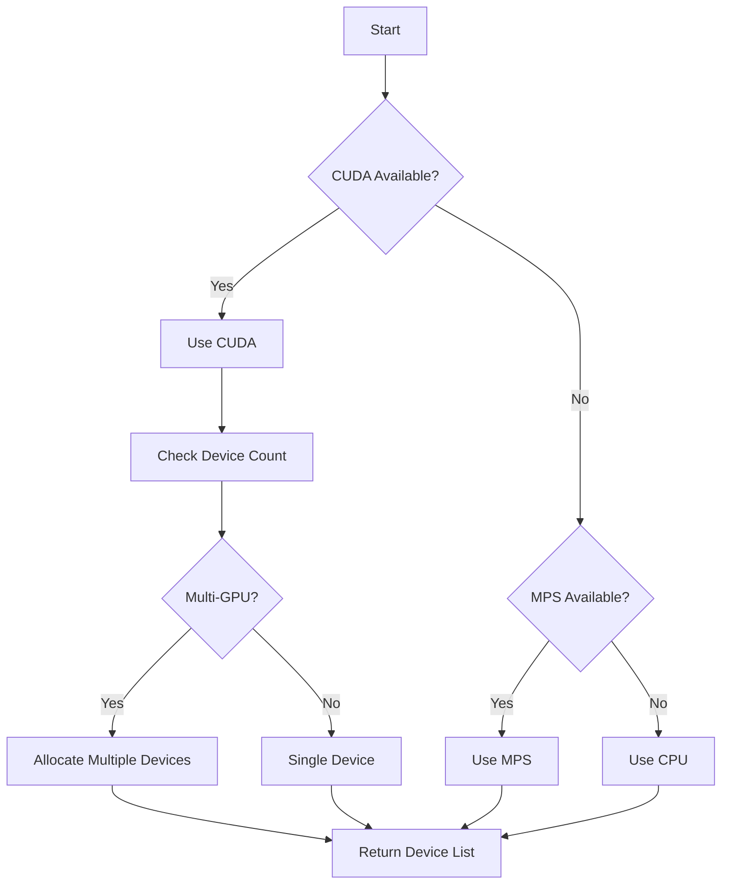

# GPU Acceleration - Technical Architecture

## Overview

ELEANOR V8's GPU acceleration provides 5-15x performance improvements through:
- Hardware-accelerated inference (CUDA, MPS)
- Asynchronous GPU operations
- Multi-stream parallelization
- Memory-efficient computation

---

## Architecture

```
engine/gpu/
├── __init__.py           # Public API
├── manager.py            # GPUManager (device detection, monitoring)
├── async_ops.py          # AsyncGPUExecutor (async operations)
├── embeddings.py         # GPU-accelerated embeddings (Phase 3)
├── batch_processor.py    # Batch processing (Phase 4)
├── parallelization.py    # Multi-GPU support (Phase 5)
└── memory_optimization.py # Memory techniques (Phase 6)
```

---

## Components

### 1. GPUManager

**Purpose:** Device detection and resource management

**Features:**
- Auto-detect CUDA (NVIDIA), MPS (Apple), or CPU
- Multi-GPU device allocation
- Memory statistics and monitoring
- Health checks

**API:**
```python
from engine.gpu import GPUManager

gpu = GPUManager(preferred_devices=[0, 1])  # Use GPUs 0 and 1

device = gpu.get_device()           # Get default device
stats = gpu.memory_stats(0)         # Memory stats for GPU 0
health = gpu.health_check()         # Check all GPUs
```

**Implementation:**
```python
class GPUManager:
    def __init__(self, preferred_devices=None):
        self.device = self._detect_device()
        self.devices_available = torch.cuda.device_count()
    
    def _detect_device(self):
        if torch.cuda.is_available():
            return torch.device("cuda")
        elif torch.backends.mps.is_available():
            return torch.device("mps")
        return torch.device("cpu")
```

---

### 2. AsyncGPUExecutor

**Purpose:** Asynchronous GPU operations with async/await

**Features:**
- Multiple CUDA streams for parallelization
- Non-blocking GPU execution
- Async/await integration
- Batch execution support

**API:**
```python
from engine.gpu import AsyncGPUExecutor

executor = AsyncGPUExecutor(device, num_streams=4)

# Single operation
result = await executor.execute_async(gpu_operation, args)

# Batch operations
ops = [(op1, args1, {}), (op2, args2, {})]
results = await executor.batch_execute(ops)
```

**Implementation:**
```python
class AsyncGPUExecutor:
    def __init__(self, device, num_streams=4):
        if device.type == "cuda":
            self.streams = [torch.cuda.Stream(device) for _ in range(num_streams)]
        else:
            self.streams = [None] * num_streams
    
    async def execute_async(self, operation, *args, **kwargs):
        stream = self.get_stream()
        
        if stream:
            with torch.cuda.stream(stream):
                result = operation(*args, **kwargs)
                await asyncio.get_event_loop().run_in_executor(
                    None, stream.synchronize
                )
        else:
            result = operation(*args, **kwargs)
        
        return result
```

---

## Device Detection Logic



---

## Memory Management

### Memory Statistics

```python
stats = gpu.memory_stats(device_id=0)

{
    "device_id": 0,
    "allocated_mb": 1024.5,      # Currently allocated
    "reserved_mb": 2048.0,        # Reserved by PyTorch
    "max_allocated_mb": 3072.0,   # Peak usage
    "total_mb": 24576.0,          # Total GPU memory
    "utilization_pct": 4.17,      # Utilization %
}
```

### Memory Optimization Strategies

**1. Mixed Precision (FP16)**
- 50% memory reduction
- 2x throughput improvement
- Supported on V100, A100, RTX GPUs

**2. Quantization (8-bit/4-bit)**
- 75% memory reduction (8-bit)
- 87.5% memory reduction (4-bit)
- Minimal accuracy loss

**3. Gradient Checkpointing**
- Trade compute for memory
- Useful for large models

---

## CUDA Streams

### What are CUDA Streams?

CUDA streams enable parallel GPU operations:

```python
# Without streams (sequential)
result1 = operation1()  # GPU idle during CPU work
result2 = operation2()  # GPU idle during CPU work

# With streams (parallel)
stream1 = torch.cuda.Stream()
stream2 = torch.cuda.Stream()

with torch.cuda.stream(stream1):
    result1 = operation1()  # Executes on stream1

with torch.cuda.stream(stream2):
    result2 = operation2()  # Executes on stream2 (in parallel!)

stream1.synchronize()
stream2.synchronize()
```

### AsyncGPUExecutor Stream Management

```python
executor = AsyncGPUExecutor(device, num_streams=4)

# Operations automatically distributed across streams
await executor.execute_async(op1)  # Uses stream 0
await executor.execute_async(op2)  # Uses stream 1
await executor.execute_async(op3)  # Uses stream 2
await executor.execute_async(op4)  # Uses stream 3
await executor.execute_async(op5)  # Wraps to stream 0
```

**Benefits:**
- 20-30% throughput improvement
- Better GPU utilization
- Overlapping compute and data transfer

---

## Performance Characteristics

### Latency vs Throughput

**Single Request (Latency-Optimized):**
- Use 1-2 streams
- Minimize synchronization overhead
- Best for interactive applications

**Batch Requests (Throughput-Optimized):**
- Use 4-8 streams
- Maximize GPU utilization
- Best for batch processing

### Scaling

**Single GPU:**
```
Baseline (CPU):    1x
CUDA (single):     5-10x
CUDA (streams):    6-12x
CUDA (mixed):      8-15x
```

**Multi-GPU:**
```
1 GPU:  5-10x
2 GPUs: 8-18x
4 GPUs: 15-35x
```

---

## Platform Support

### NVIDIA (CUDA)

**Supported:**
- GTX 1660 and newer (Turing+)
- RTX 20/30/40 series
- Tesla V100, A100, H100
- CUDA 11.8, 12.x

**Features:**
- ✅ Multiple streams
- ✅ Mixed precision (FP16, BF16)
- ✅ Tensor cores (RTX+)
- ✅ Multi-GPU
- ✅ FlashAttention

### Apple Silicon (MPS)

**Supported:**
- M1, M2, M3 (all variants)
- macOS 12.3+

**Features:**
- ✅ Unified memory
- ✅ Neural Engine integration
- ❌ No streams (not needed)
- ❌ No mixed precision (yet)
- ❌ Single device only

**Note:** MPS typically 2-4x faster than CPU for inference

### CPU Fallback

**Always available:**
- ✅ No special hardware needed
- ✅ Works everywhere
- ❌ Slower (1x baseline)

---

## Configuration

### GPU Configuration: `config/gpu.yaml`

```yaml
gpu:
  enabled: true
  device_preference: ["cuda", "mps", "cpu"]
  
  multi_gpu:
    enabled: false
    device_ids: [0, 1, 2, 3]
    strategy: "data_parallel"
  
  memory:
    mixed_precision: true
    precision: "fp16"
    quantization:
      enabled: false
      bits: 8
  
  async:
    num_streams: 4
  
  monitoring:
    log_memory_stats: true
    memory_check_interval: 60
```

---

## Integration Points

### Engine Integration

```python
class EleanorEngineV8:
    def __init__(self, *, gpu_manager=None, ...):
        if gpu_manager:
            self.gpu = gpu_manager
            self.gpu_executor = AsyncGPUExecutor(
                self.gpu.device,
                num_streams=config.gpu.num_streams
            )
```

### Router Integration

```python
class RouterV2:
    async def route(self, ...):
        if self.gpu:
            # Use GPU-accelerated routing
            scores = await self.gpu_executor.execute_async(
                compute_routing_scores, query
            )
```

### Critic Integration

```python
class CriticProtocol:
    async def evaluate_batch(self, proposals):
        if self.gpu:
            # Batch critic execution on GPU
            operations = [(self.evaluate, (p,), {}) for p in proposals]
            results = await self.gpu_executor.batch_execute(operations)
```

---

## Future Phases

### Phase 3: GPU Embeddings
- GPU-accelerated embedding computation
- Embedding cache on GPU memory
- Vectorized similarity search

### Phase 4: Batch Processing
- Dynamic batching
- Automatic batch size optimization
- Request queuing and coalescing

### Phase 5: Multi-GPU
- Data parallelism
- Model parallelism
- Pipeline parallelism

### Phase 6: Memory Optimization
- FlashAttention integration
- Quantization (4-bit, 8-bit)
- KV cache optimization

### Phase 7: Production Features
- GPU monitoring and alerting
- Graceful degradation
- Auto-scaling

---

## References

- [PyTorch CUDA Documentation](https://pytorch.org/docs/stable/cuda.html)
- [CUDA Programming Guide](https://docs.nvidia.com/cuda/)
- [Apple MPS Backend](https://pytorch.org/docs/stable/notes/mps.html)
- [Mixed Precision Training](https://pytorch.org/docs/stable/amp.html)
