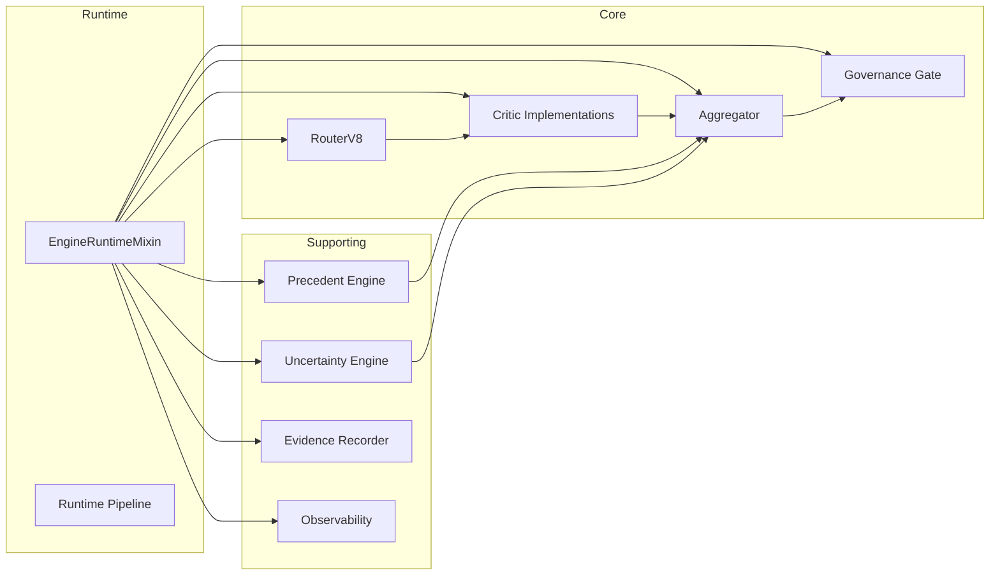

# Component Diagram

```mermaid
graph LR
    subgraph Runtime
        Engine[EngineRuntimeMixin]
        Pipeline[Runtime Pipeline]
    end
    subgraph Core
        Router[RouterV8]
        Critics[Critic Implementations]
        Aggregator[Aggregator]
        Governance[Governance Gate]
    end
    subgraph Supporting
        Precedent[Precedent Engine]
        Uncertainty[Uncertainty Engine]
        Recorder[Evidence Recorder]
        Observability[Observability]
    end

    Engine --> Router
    Engine --> Critics
    Engine --> Aggregator
    Engine --> Governance
    Engine --> Precedent
    Engine --> Uncertainty
    Engine --> Recorder
    Engine --> Observability

    Router --> Critics
    Critics --> Aggregator
    Aggregator --> Governance
    Precedent --> Aggregator
    Uncertainty --> Aggregator
```

This diagram maps to code under `engine/` and `governance/`.
