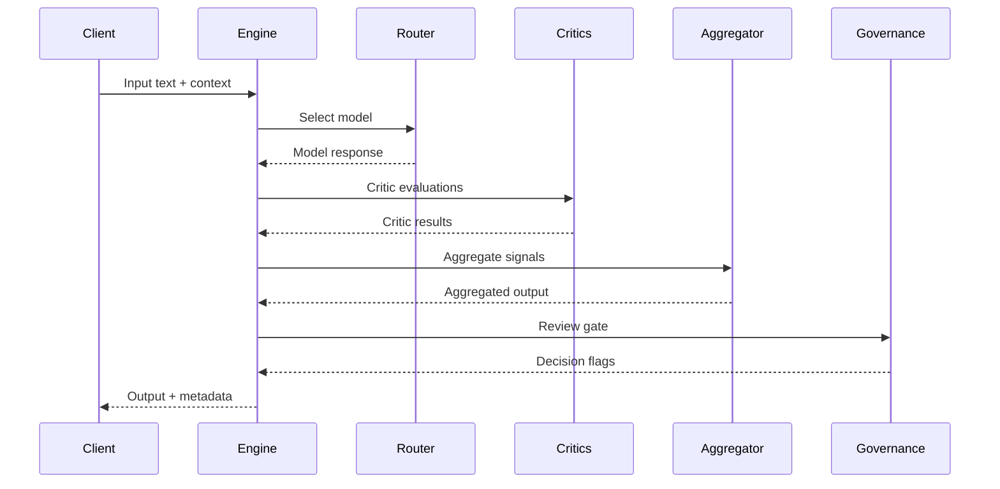

# Data Flow

ELEANOR V8 passes a structured context payload through each pipeline stage. Each stage
may add evidence and diagnostics while preserving original input.

## Evidence propagation

Evidence is recorded via the recorder interface and attached to the output in detail
levels 2 and 3. See `engine/runtime/run.py` for the evidence lifecycle.
