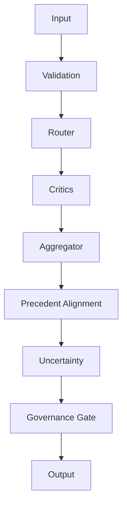

# Architecture Overview

ELEANOR V8 implements a constitutional AI governance pipeline. The engine receives input,
selects a model, runs multiple independent critics, aggregates their signals, and applies
governance gates before producing a final output.

## High-level flow

## Core modules

- Engine runtime: `engine/runtime/`
- Critics: `engine/critics/`
- Router: `engine/router/`
- Governance: `engine/governance/`
- Precedent: `engine/precedent/`
- Uncertainty: `engine/uncertainty/`
- Observability: `engine/observability/`

For deeper details, see `docs/ARCHITECTURE.md` and `docs/V8_SPEC.md`.
